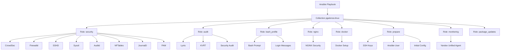

# Ansible Collection: pgalonza.linux - Agents Overview

## General Information

**Collection:** `pgalonza.linux`  
**Version:** 1.0.0  
**Author:** Peter Galonza  
**License:** Apache-2.0  

This Ansible collection is designed for configuring and setting up Linux systems according to security best practices and automation standards. The collection contains roles for various aspects of system administration, security, and auditing.

## Collection Architecture



## Roles as AI Agents

Each role in the collection can be considered as a specialized "agent" performing specific automation tasks:

### 1. **Security Agent (security)**
**Responsibility:** Comprehensive Linux system security configuration
- **Components:**
  - CrowdSec - intrusion detection and prevention system
  - Firewalld/NFTables - firewall configuration
  - SSHD - secure SSH server configuration
  - Sysctl - kernel parameter optimization
  - Auditd - auditing system
  - JournalD - logging configuration
  - PAM - authentication module configuration

### 2. **Audit Agent (audit)**
**Responsibility:** Security status reporting and assessment
- **Tools:**
  - Lynis - system security audit
  - KVRT (Kaspersky Virus Removal Tool) - malware scanning
  - Security recommendations generation

### 3. **Interface Agent (bash_profile)**
**Responsibility:** User interface customization and human error reduction
- **Functions:**
  - Bash prompt customization (PS1)
  - Informational login messages
  - Visual cues for different server roles

### 4. **Web Server Agent (nginx)**
**Responsibility:** NGINX installation and security configuration
- **Features:**
  - Basic NGINX installation
  - Security configuration
  - Depends on `nginxinc.nginx_core.nginx` role

### 5. **Containerization Agent (docker)**
**Responsibility:** Docker installation and setup
- **Functions:**
  - Docker Engine installation
  - Basic configuration

### 6. **Preparation Agent (prepare)**
**Responsibility:** Initial server preparation for Infrastructure as Code
- **Tasks:**
  - SSH key configuration
  - SSHD setup
  - Ansible user creation
  - Basic system preparation

### 7. **Monitoring Agent (monitoring)**
**Responsibility:** Linux system monitoring configuration
- **Components:**
  - Unified Agent (Monium) — Yandex Cloud metrics collection

### 8. **Package Updates Agent (package_updates)**
**Responsibility:** Manage package updates with version pinning
- **Functions:**
  - Security and full system updates
  - Package version pinning and unpinning
  - Multi-distribution support (apt/yum/dnf)

## Agent Interaction

### Execution Sequence
1. **prepare** → Initial system preparation
2. **security** → Comprehensive security configuration
3. **bash_profile** → User interface customization
4. **audit** → Verification and reporting
5. **monitoring** → System monitoring configuration
6. **nginx/docker** → Additional software installation (as needed)

### Dependencies
- `nginx` role depends on external collection `nginxinc.nginx_core.nginx`
- All roles are independent but logically connected through common playbook
- `package_updates` role supports apt (Debian/Ubuntu) and yum/dnf (RHEL/CentOS)

## Variables and Configuration

### Key Variables for AI Agents
Each role provides a set of customization variables:

#### Monitoring Agent
```yaml
yua_poll_period: "15s"
yua_linux_metrics_detalization: "basic"
```

#### Security Agent
```yaml
# CrowdSec
crowdsec_in_docker: false
crowdsec_version: "latest"

# SSHD
sshd_port: 22
sshd_max_auth_tries: 3
sshd_allow_agent_forwarding: false

# Sysctl
sysctl_user_namespace_enabled: true
sysctl_icmp_echo_ignore_all: false

# NFTables
nftables_allowed_tcp_dports: ["22", "80", "443"]
```

#### Audit Agent
```yaml
audit_dir: "/var/log/audit_reports"
lynis_version: "3.0.8"
auditor_name: "System Auditor"
```

#### Bash Profile Agent
```yaml
bash_prompt: "\\[\\033[01;32m\\]\\u@\\h\\[\\033[00m\\]:\\[\\033[01;34m\\]\\w\\[\\033[00m\\]\\$ "
bash_server_role: "Production"
bash_on_login_message: "Welcome to secured server"
```

## Collection Usage

### Basic Playbook
```yaml
- hosts: all
  become: true
  collections:
    - pgalonza.linux
  roles:
    - security
    - bash_profile
    - audit
```

### Selective Usage
```yaml
- hosts: web_servers
  collections:
    - pgalonza.linux
  roles:
    - prepare
    - security
    - nginx
```

## Testing with Molecule

The collection includes Molecule tests for each role:
- **monitoring** - tests for Unified Agent deployment
- **security** - tests for CrowdSec, firewalld, SSH, PAM
- **audit** - tests for Lynis and general audit
- **bash_profile** - tests for prompt and messages
- **prepare** - tests for SSH configuration
- **nginx** - tests for NGINX installation

## For AI Agents: Usage Context

### When to use this collection:
1. **Automating deployment of secure Linux servers**
2. **Standardizing security configurations**
3. **Auditing existing systems**
4. **Preparing infrastructure for compliance**
5. **Creating base images for containers/VMs**

### What this collection does NOT do:
- Does not manage upper-level applications
- Does not manage cloud resources
- Does not provide full compliance for specific standards

## Additional Resources

- **Galaxy:** `pgalonza.linux`
- **Source Code:** [GitHub repository]
- **Documentation:** README files in each role
- **Requirements:** `requirements.yml` for dependencies

## Contacts and Support

- **Author:** Peter Galonza <p.galonza@evaron.ru>
- **License:** Apache-2.0
- **Tags:** linux, security, audit, prompt, crowdsec, sshd, sysctl, firewalld, nftables

---

*This document is intended for AI agents working with Ansible automation. Update as the collection evolves.*